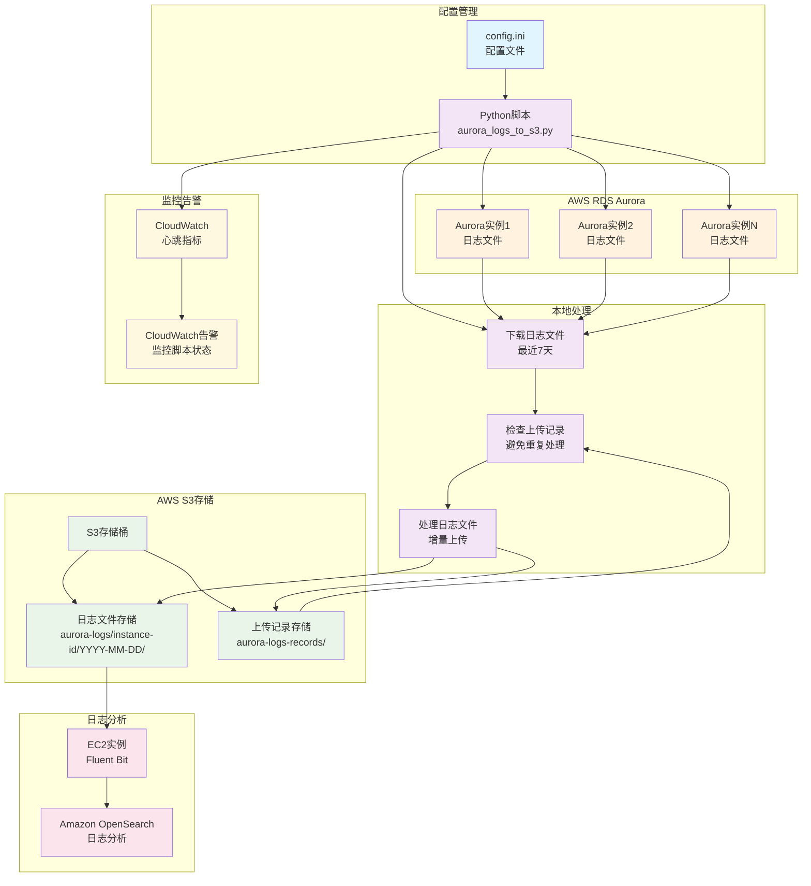
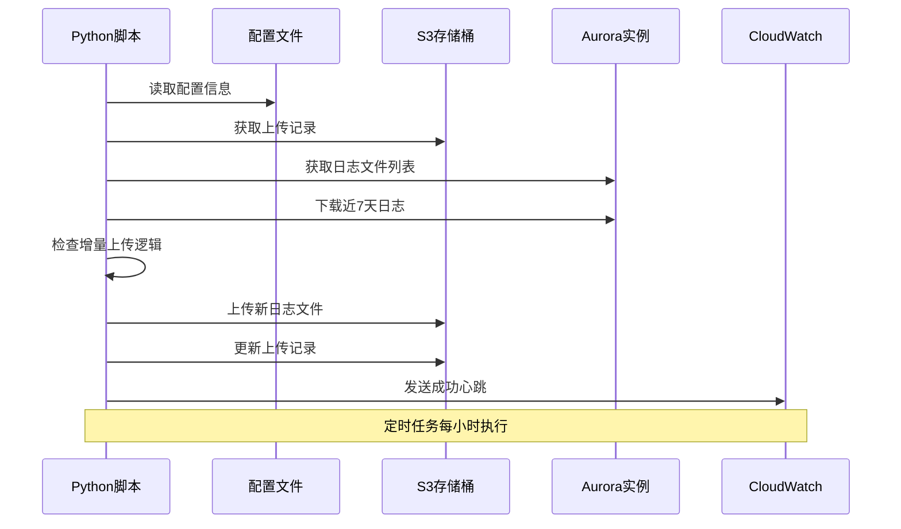
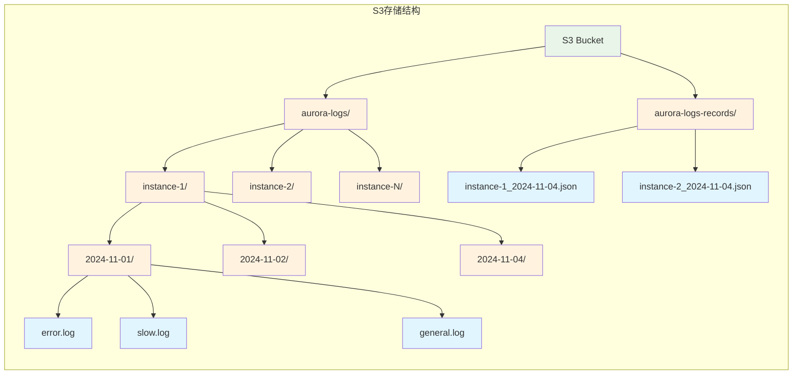
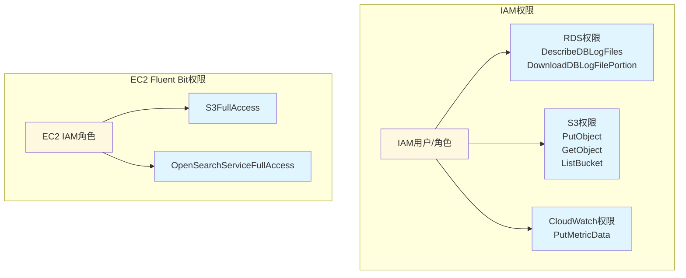

# Aurora Logs to S3 架构图

## 系统架构流程图

```mermaid
graph TB
    subgraph "配置管理"
        A[config.ini<br/>配置文件] --> B[Python脚本<br/>aurora_logs_to_s3.py]
    end
    
    subgraph "AWS RDS Aurora"
        C1[Aurora实例1<br/>日志文件]
        C2[Aurora实例2<br/>日志文件]
        C3[Aurora实例N<br/>日志文件]
    end
    
    subgraph "本地处理"
        B --> D[下载日志文件<br/>最近7天]
        D --> E[检查上传记录<br/>避免重复处理]
        E --> F[处理日志文件<br/>增量上传]
    end
    
    subgraph "AWS S3存储"
        G[S3存储桶]
        H[日志文件存储<br/>aurora-logs/instance-id/YYYY-MM-DD/]
        I[上传记录存储<br/>aurora-logs-records/]
        G --> H
        G --> I
    end
    
    subgraph "监控告警"
        J[CloudWatch<br/>心跳指标]
        K[CloudWatch告警<br/>监控脚本状态]
    end
    
    subgraph "日志分析"
        L[EC2实例<br/>Fluent Bit]
        M[Amazon OpenSearch<br/>日志分析]
    end
    
    %% 数据流向
    B --> C1
    B --> C2  
    B --> C3
    C1 --> D
    C2 --> D
    C3 --> D
    F --> H
    F --> I
    I --> E
    B --> J
    J --> K
    H --> L
    L --> M
    
    %% 样式定义
    classDef config fill:#e1f5fe
    classDef aurora fill:#fff3e0
    classDef process fill:#f3e5f5
    classDef storage fill:#e8f5e8
    classDef monitor fill:#fff8e1
    classDef analysis fill:#fce4ec
    
    class A config
    class C1,C2,C3 aurora
    class B,D,E,F process
    class G,H,I storage
    class J,K monitor
    class L,M analysis
```

## 数据流程说明

```mermaid
sequenceDiagram
    participant Script as Python脚本
    participant Config as 配置文件
    participant S3 as S3存储桶
    participant Aurora as Aurora实例
    participant CW as CloudWatch
    
    Script->>Config: 读取配置信息
    Script->>S3: 获取上传记录
    Script->>Aurora: 获取日志文件列表
    Script->>Aurora: 下载近7天日志
    Script->>Script: 检查增量上传逻辑
    Script->>S3: 上传新日志文件
    Script->>S3: 更新上传记录
    Script->>CW: 发送成功心跳
    Note over Script,CW: 定时任务每小时执行
```

## 存储结构图

```mermaid
graph LR
    subgraph "S3存储结构"
        A[S3 Bucket] --> B[aurora-logs/]
        A --> C[aurora-logs-records/]
        
        B --> D[instance-1/]
        B --> E[instance-2/]
        B --> F[instance-N/]
        
        D --> G[2024-11-01/]
        D --> H[2024-11-02/]
        D --> I[2024-11-04/]
        
        G --> J[error.log]
        G --> K[slow.log]
        G --> L[general.log]
        
        C --> M[instance-1_2024-11-04.json]
        C --> N[instance-2_2024-11-04.json]
    end
    
    classDef bucket fill:#e8f5e8
    classDef folder fill:#fff3e0
    classDef file fill:#e1f5fe
    
    class A bucket
    class B,C,D,E,F,G,H,I folder
    class J,K,L,M,N file
```

## 权限和安全架构

```mermaid
graph TB
    subgraph "IAM权限"
        A[IAM用户/角色] --> B[RDS权限<br/>DescribeDBLogFiles<br/>DownloadDBLogFilePortion]
        A --> C[S3权限<br/>PutObject<br/>GetObject<br/>ListBucket]
        A --> D[CloudWatch权限<br/>PutMetricData]
    end
    
    subgraph "EC2 Fluent Bit权限"
        E[EC2 IAM角色] --> F[S3FullAccess]
        E --> G[OpenSearchServiceFullAccess]
    end
    
    classDef iam fill:#fff8e1
    classDef permission fill:#e1f5fe
    
    class A,E iam
    class B,C,D,F,G permission
```
